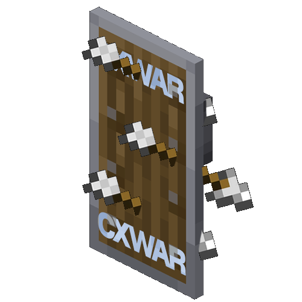

#
A personal plugin used on my own server. Doesn't offer too much customizability but is a good starting point if you want a similar plugin.

## Features

### Mechanics

- Reveal: Show a player's location
- Hidden: Hide from potential reveals
- Group: Create a group with others
- Killstreaks: Keep track of how many players you've killed in a life and get rewards (rewards not added yet)
- Whispher: Talk to others

### Commands
- `/reveal [target]`: Reveal a target's location with a cooldown
- `/hidden [start/end] [diamond/netherite]`: Protect yourself from reveals using diamonds and netherite
- `/group [create/join/leave, invite/delete/kick/color] [name]`: Create, join, leave, etc., groups
- `/killstreak [target]`: See your own or other's current killstreak
- `/whisper [target] [message]`: Secretly chat with other players
- `/tpr [target]`: Send a teleport request to a player
- `/tpa [target]`: Accept a teleport request from a player
